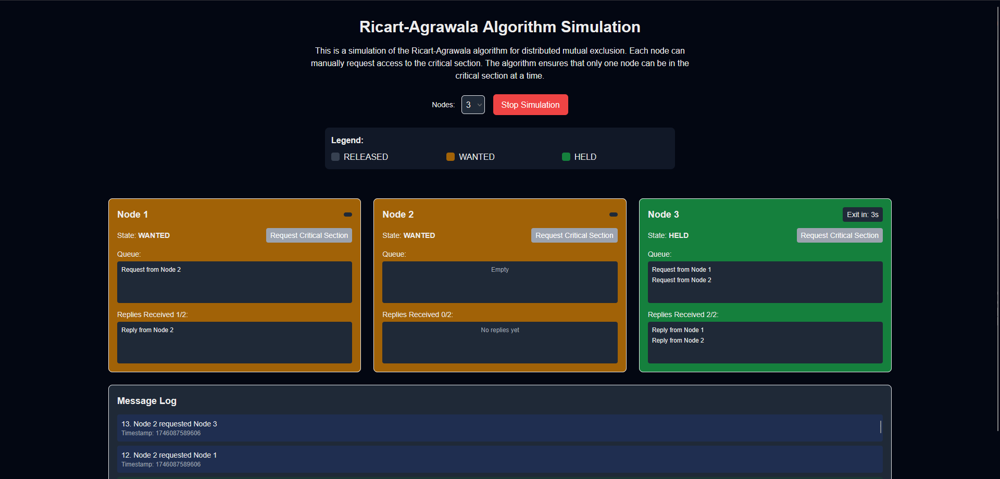

# Ricart-Agrawala Algorithm Simulation

A web-based simulation demonstrating the Ricart-Agrawala distributed mutual exclusion algorithm. Built with Next.js and Tailwind CSS, it lets you configure nodes, manually request access to the critical section, and visualize message passing (requests and replies) in real time.

## Demo



## Features

- Adjustable number of nodes (2–6)
- Visual queue display of pending requests per node
- Checkbox-based replies tracker
- Critical section timer visualization
- Live message log (requests/replies)

## Getting Started

### Prerequisites

- Node.js (>=14)
- npm or Yarn

### Installation

```bash
git clone https://github.com/yourusername/ricart-agrawala.git
cd ricart-agrawala
npm install
# or
yarn install
```

### Running the Development Server

```bash
npm run dev
# or
yarn dev
```

Open http://localhost:3000 in your browser.

## Usage

1. Select the number of nodes.
2. Start the simulation.
3. Click "Request Critical Section" on any node.
4. Observe the queue, reply checkboxes, and message log.
5. Watch nodes enter and exit the critical section.

## Project Structure

```text
app/
  components/
    Node.tsx            # Node UI and Ricart-Agrawala logic
    MessageVisualizer.tsx  # Message log display
    Simulation.tsx      # Simulation controller and layout
  page.tsx             # Landing page
  globals.css          # Tailwind CSS imports and custom styles
next.config.mjs       # Next.js export config
tailwind.config.ts    # Tailwind CSS config
...                   # Other config and font files
```

## Customization

- Modify Tailwind theme in `tailwind.config.ts`
- Extend algorithm timing and behavior in `Node.tsx`